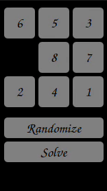

# 8 Puzzle: A* Algorithm
Boys and girls! Gather around! Gather around! This is an A* story!

So when I was studying AI in my bachelor's degree, we had a chapter on search algorithms. Supposedly, A* was the coolest, meanest, best bad boy of search algorithms in town!

A classic example for applying A* is the 8 Puzzle, where the numbers 1 to 8 are scattered in a grid of 3 by 3. Using the blank/empty cell, you should order the cells from 1 to 8. It is a stupid game, come to think of it, but who am I to judge?

This project implements the A* algorithm to solve the 8 puzzle and has a graphical demonstration of the solution. 8 Puzzle Solver is implemented using Python and PyQT.

Also, I wrote this code back in 2017. I did some minor improvements recently, but there are a lot here I am not proud of structurally. I was a kid back then! Sue me!

Running:
---
Just run main.py and be dazzled! Also, here is a demo.

License
-------

The MIT License. Copyright (c) 2017 Amin Fadaee

About Me
----------------

[Amin Fadaee](https://www.linkedin.com/in/aminfadaee/)

