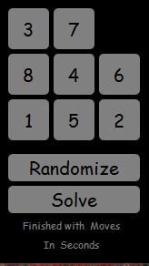
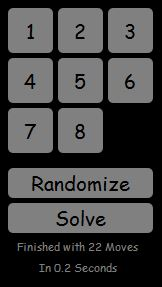

# 8 Puzzle Solver

This project implements the A* algorithm to solve the 8 puzzle and has a graphical demonstration of the solution. 8 Puzzle Solver is implemented using Python 3.4, PyQT4 and by the help of a third party library, [fibonacci_heap_mod](https://pypi.python.org/pypi/fibonacci-heap-mod/), Authored by Daniel Richard Stromberg.

Documentation
-------------
I am currently working on designing a detailed documentation of the project which will be available real soon.

Running:
---
Run the project by running Main.py

You can use the Randomize button to change the game board arrangement and the Solve button would solve the formation and displays the moves on the board. The time for the algorithm and the number of states are depicted as well.

License
-------

The MIT License. Copyright (c) 2017 Amin Fadaee

About Author
----------------

[Amin Fadaee](https://www.linkedin.com/in/aminfadaee/)

